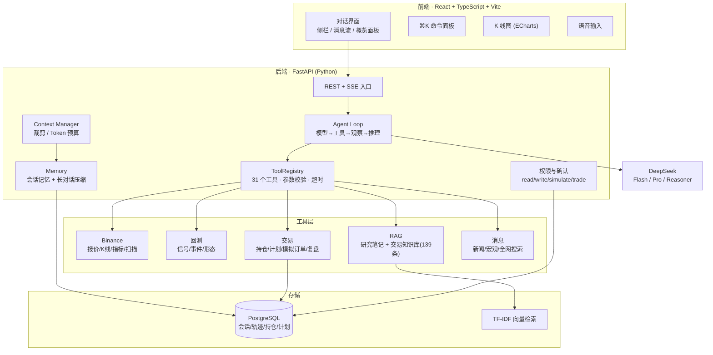

# Trading Agent 架构

一个面向 Crypto 交易研究的对话式 Agent。自研 Mini Harness(不依赖 LangChain/LangGraph),30+ 个确定性工具,前端对齐 Apple 设计语言。

## 1. 系统架构



## 2. 技术栈

| 层 | 技术 |
|---|---|
| 前端 | React 19、TypeScript、Vite、ECharts、react-markdown、Web Speech API、PWA |
| 后端 | FastAPI、Python 3.13、httpx、Pydantic v2 |
| Agent | 自研 Mini Harness(Agent Loop、ToolRegistry、Context、Memory、权限、评测) |
| 数据 | PostgreSQL + SQLAlchemy 2 (async) + Alembic、TF-IDF 向量检索 |
| 流式 | SSE(真 token 级流式,含 reasoning 思考过程) |
| 部署 | Docker(单容器 + Compose)、Railway、国内云服务器 |

## 3. 核心设计

### 3.1 Agent Loop(自研)

```
用户任务 → 模型判断 → 工具调用 → 执行工具 → 观察结果 → 继续推理 → 最终回答
```

- 显式 `for` 循环 + `max_steps` 保护,控制流直白可审计。
- 流式:模型逐 token 产出回答(`answer_delta`),思考过程单独流(`reasoning_delta`)。
- 工具调用与最终回答分离,支持多轮工具调用。

### 3.2 工具系统(ToolRegistry)

- 统一接口:`name + description + Pydantic input_model + handler + timeout + permission`。
- 参数用 Pydantic 校验,失败返回结构化错误(不抛异常中断)。
- 权限分级:`read`(直接执行)/ `write`(记录类)/ `simulate`(模拟订单,需确认)/ `prohibited`(真实交易,首月禁止)。
- **权限由确定性代码决定,不由 LLM 决定。**

### 3.3 Context 与 Memory

- **Context Manager**:消息数 + 字符数 + Token 数三重预算,CJK 精确估算,行情过期标记。
- **长对话压缩**:超阈值时模型总结旧消息为"背景事实摘要",摘要游标写回 PostgreSQL,重启不重复总结。
- **会话记忆**(当前对话)+ **持久化记忆**(持仓/计划/复盘)+ **知识库 RAG**(139 条交易心法)。

### 3.4 安全与可信

- 首月只读:没有真实下单/提现/转账工具,模拟订单需人工确认。
- 不伪造:无数据源时明确降级(新闻未配置就返回"未配置",绝不编造)。
- 回测带限制说明:数据来源、样本数、非预测声明。
- 可信回答:执行轨迹内联,可查看用了哪些工具、数据来源、K 线数。

## 4. 一次对话的完整数据流

```
用户输入 "分析 BTC 走势"
  → 前端 POST /api/chat/stream (SSE)
  → Agent Loop 构建 [system, history, user] 上下文
  → 模型决定调用 get_klines 工具
  → ToolRegistry 校验参数 → Binance 拉取 K 线
  → 结果回填消息 → 模型继续推理
  → 逐 token 流式返回答案(answer_delta)
  → 前端渲染 Markdown + K 线图(ECharts)
  → 会话/轨迹持久化到 PostgreSQL
  → 长对话触发压缩,摘要写回
```

## 5. 设计亮点(简历可讲)

1. **从零手写 Agent Harness**:不依赖 LangChain/LangGraph,自己实现 Agent Loop、工具注册、上下文管理、权限确认、评测集。
2. **真 token 级流式输出**:SSE 逐字推送,含 DeepSeek Reasoner 的思考过程流。
3. **确定性工具 + 可信回答**:31 个工具统一 schema,回测/风险计算可解释,回答带数据来源与限制说明。
4. **事件溯源式持久化**:会话、执行轨迹、确认票据、恢复点全部落库,支持重启恢复与重放。
5. **长对话压缩 + RAG**:摘要游标 + 139 条交易知识库的 TF-IDF 检索。
6. **苹果风前端**:毛玻璃材质、弹簧反馈、⌘K 命令面板、PWA 手机适配、深浅色主题。
7. **生产部署**:Docker 单容器 + Compose,已上线 Railway,支持国内云服务器。
